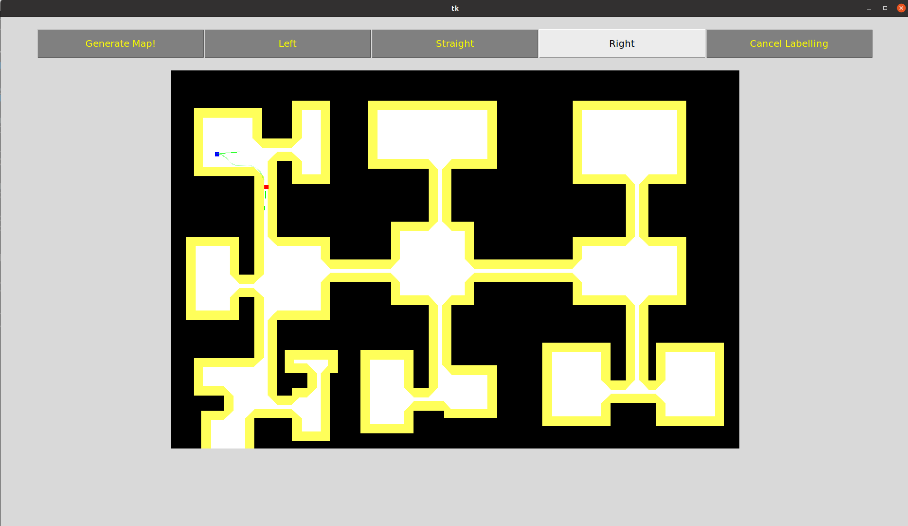

# intentionNavigation

This code base contains code for training a model to perform intention based navigation. The model will be fed with an intention (left, straight or right), and attempt to navigate the robot accordingly. It should be noted that the model in this version of the code only uses LiDAR image without plotted odometry. More details are laid out in our report. 

## Getting started

Run the following commands to install the required packages for this repository
```
python3 -m venv .venv/
source .venv/bin/activate
pip install -r requirements.txt
```

## Summary of Code

- [dataLoader.py](dataLoader.py): Handles loading of labelled trajectory and intention data
- [env.py](env.py): Contains code relating to the setup of our training environment. Follows the [gymnasium](https://gymnasium.farama.org/) API. 
- [generateLabelledData.py](generateLabelledData.py): Program that allows user to generate trajectories and label intentions.
- [map.py](map.py): Contains code for the map data structure
- [net.py](net.py): Code for both actor and critic neural networks
- [params.py](params.py): Configuration file for configuring training and evaluation parameters
- [path.py](path.py): Code for trajectory generation
- [ppo.py](ppo.py): The main training and evaluation code. Implements the ppo algorithm.
- [robot.py](robot.py): Contains code for the robot's motion model, state tracking and LiDAR feedback image generation
- [utilTypes.py](utilTypes.py): Miscellaneous utilities

## Running the Trained Model

Run the following command to see the model in action. This will run [ppo.py](ppo.py) in evaluation mode, and render the resultant movement of the robot based on the model's output.

```
python3 ppo.py
```

## Generating More Labeled Data

We have provided around 40 pairs of labelled trajectory and intention in [labelledData](labelledData). If you would like to generate more, run the following:

```
python3 generateLabelledData.py
```

This launches the labelled data generator. You can click on generate map to generate a new random map (as detailed in the report). When you see a map you like, you can click on your desired start point and drag your mouse in the direction you want your starting pose. Release your mouse to set its angle.

Repeat the click, drag and release too set the desired end pose (given the intention you have in mind). The program will find a smoothened trajectory. If you are satisfied with it, click on the correct intention (left, straight of right) to label the trajectory. 



Once you are done with labelling, press esc to exit the program and save the labelled data.

## Training the Model

To train the model from scratch, modify the following fields in [params.py](params.py).

Under **NetParameters**:

- Set LOAD_MODEL to False
- Set EVALUATE to False

Under **WandbSettings**:
- Set ON to True (Assuming you want to use Wandb)

Under **EnvParameters**:
- Set RENDER to False. The program will no longer render to screen, speeding up training

Configure the training parameters under TrainingParameters, as desired.

Next, run the following command to run [ppo.py](ppo.py) in training mode without rendering and with logging to the cloud using Wandb.

```
python3 ppo.py
```
